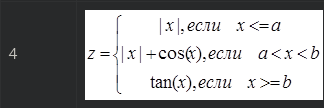
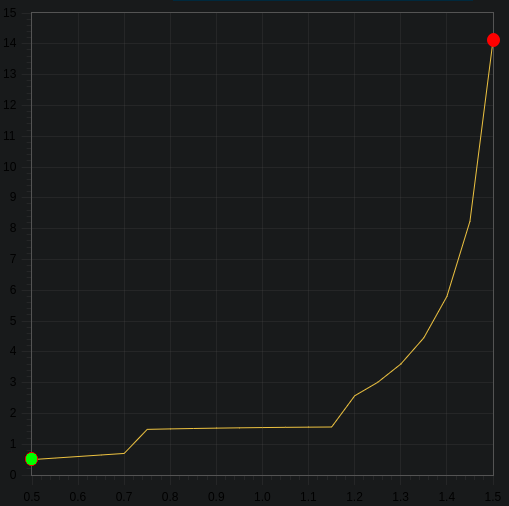

МИНИСТЕРСТВО НАУКИ  И ВЫСШЕГО ОБРАЗОВАНИЯ РОССИЙСКОЙ ФЕДЕРАЦИИ  
Федеральное государственное автономное образовательное учреждение высшего образования  
"КРЫМСКИЙ ФЕДЕРАЛЬНЫЙ УНИВЕРСИТЕТ им. В. И. ВЕРНАДСКОГО"  
ФИЗИКО-ТЕХНИЧЕСКИЙ ИНСТИТУТ  
Кафедра компьютерной инженерии и моделирования
<br/><br/>

### Отчёт по лабораторной работе № 2<br/> по дисциплине "Программирование"
<br/>

студента 1 курса группы ПИ-б-о-191(2) 
Кадников Дмитрий Андреевич
направления подготовки 09.03.04 "Программая инженерия"  
<br/>

<table>
<tr><td>Научный руководитель<br/> старший преподаватель кафедры<br/> компьютерной инженерии и моделирования</td>
<td>(оценка)</td>
<td>Чабанов В.В.</td>
</tr>
</table>
<br/><br/>

Симферополь, 2019
***
Цель:
1. Овладеть практическими навыками разработки и программирования вычислительного процесса циклической структуры;
2. Сформировать навыков программирования алгоритмов разветвляющейся структуры;
3. Изучить операторы ветвления. Особенности использования полной и сокращенной формы оператора if и тернарного оператора.

Задачи:
1. Напишите на языке С++ программу которая для функции f(x) на интервале x ∈ [хнач; xкон] (Значения параметров a, b, начала и конца интервала хнач, xкон и шага dx вводятся пользователем.) Которая:
 * выводит в консоль значения функции f(x) с шагом dx;
 * определяет максимальное и минимальное значение функции.

 

 Рис 1 - система уровнений
2. Протабулируйте функцию и запишите получившиеся результаты в отчёт в виде таблицы. При этом a = 0.7, b = 1.2, начала и конца интервала хнач = 0.5, xкон = 1.5 и шага dx = 0.05;
3. Определите минимальное и максимальное значение функции на указанном интервале
4. Используя сервис https://www.desmos.com/calculator или подобный:
 * постройте график функции;
 * добавьте на график точки, которые у вас получились в процессе табуляции;
 * добавьте на график точки минимума и максимума с метками значений;
 * проанализируйте получившееся изображение. Особое внимание обратите на положение точек на графике при x = a и x = b;


***
#### Ход выполнения Работы
1 Программа:

```C++
#include <iostream>
#include <cmath>

const double e = 0.00005;
double z(double x, double a=0.0, double b=1.0, bool start=false);
double abs(double a);

int main()
{
    double x,dx,a,b,xe;
    std::cout << "Введите dx, a и b, x нач, x кон: ";
    std::cin >> dx >> a >> b >> x >> xe;
    double mi,ma,q;

    mi = z(x,a,b,true);
    ma = mi;
    
    for (;x - xe < e;x+=dx)
    {
        q = z(x);
        if (mi > q) mi = q;
        if (ma < q) ma = q;
        std::cout << "x = " << x << " z(x) = " << q << "\n";
    }
    std::cout << "max = " << ma << " min = " << mi << "\n";
    return 0;
}

double z(double x, double a, double b, bool start)
{
    static double af,bf;
    if (start)
    {
       af = a;
       bf = b;
    }

    if (x - af < e)
    {
        return abs(x);
    }
    else if (bf - x < e)
    {
        return tan(x);
    }
    return abs(x)+cos(x);
}

double abs(double a)
{
    if (a > 0)
    return a;
    return a*-1;
}
```


2 Таблица получившихся значений

x | z(x)
-|-
0.5 | 0.5
0.55 | 0.55
0.6 | 0.6
0.65 | 0.65
0.7 | 0.7
0.75 | 1.48169
0.8 | 1.49671
0.85 | 1.50998
0.9 | 1.52161
0.95 | 1.53168
1 | 1.5403
1.05 | 1.54757
1.1 | 1.5536
1.15 | 1.55849
1.2 | 2.57215
1.25 | 3.00957
1.3 | 3.6021
1.35 | 4.45522
1.4 | 5.79788
1.45 | 8.23809
1.5 | 14.1014

3 max = 14.1014, min = 0.5

4 График



Рис 2 - график


***
#### Вывод
В ходе работы я столкнулся с проблемамой связаные с точностью double чисел, проблему решил добавлением переменной e имеющей маленькое значение по которому поределяется равенство double чисел.
