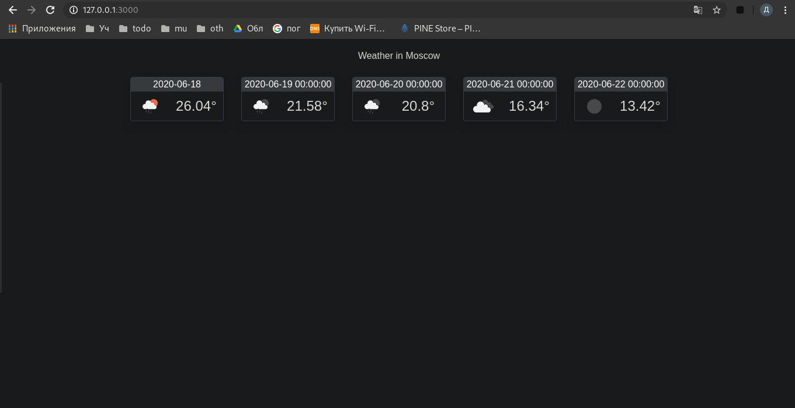

МИНИСТЕРСТВО НАУКИ  И ВЫСШЕГО ОБРАЗОВАНИЯ РОССИЙСКОЙ ФЕДЕРАЦИИ  
Федеральное государственное автономное образовательное учреждение высшего образования  
"КРЫМСКИЙ ФЕДЕРАЛЬНЫЙ УНИВЕРСИТЕТ им. В. И. ВЕРНАДСКОГО"  
ФИЗИКО-ТЕХНИЧЕСКИЙ ИНСТИТУТ  
Кафедра компьютерной инженерии и моделирования
<br/><br/>

### Отчёт по лабораторной работе № 6<br/> по дисциплине "Программирование"
<br/>

студента 1 курса группы ПИ-б-о-191(2) 
Кадников Дмитрий Андреевич
направления подготовки 09.03.04 "Программая инженерия"  
<br/>

<table>
<tr><td>Научный руководитель<br/> старший преподаватель кафедры<br/> компьютерной инженерии и моделирования</td>
<td>(оценка)</td>
<td>Чабанов В.В.</td>
</tr>
</table>
<br/><br/>

Симферополь, 2019


***
#### Цель:
0. Закрепить навыки разработки многофайловыx приложений;
1. Изучить способы работы с API web-сервиса;
0. Изучить процесс сериализации/десериализации данных.

***
#### Ход выполнения Работы

1 Ключ api 9a6051242524f56f292e8d2616580e8a

2 Код программы

```C++
#include <include/httplib/httplib.h>
#include <include/nlohmann/json.hpp>
#include <iostream>
#include <iomanip>
#include <string>
#include <fstream>

using namespace std;
using namespace nlohmann;
using namespace httplib;

//api 9a6051242524f56f292e8d2616580e8a


void injector(string& str, const string& arg1, const string& arg2);


// В этой функции формируем ответ сервера на запрос
void gen_response(const Request& req, Response& res);


void test(string& htmlStr);


int main()
{
  {
    string t;
    test(t);
  }
  Server svr;                    // Создаём сервер (пока-что не запущен)
  svr.Get("/", gen_response);    // Вызвать функцию gen_response если кто-то обратиться к корню "сайта"
  cout << "start server\n";
  svr.listen("127.0.0.1", 3000); // Запускаем сервер на localhost и порту 3000

}

void injector(string& str, const string& arg1, const string& arg2)
{
  str.replace((size_t)str.find(arg1), arg1.length(), arg2);
}

void gen_response(const Request&, Response& res) {
  string htmlStr;
  test(htmlStr);
  res.set_content(htmlStr, "text/html");
  /*
  // Команда set_content задаёт ответ сервера и тип ответа:
  // Hello, World! - тело ответа
  // text/plain - тип ответа (в данном случае обычный текст)
  res.set_content("Hello, World!", "text/plain");
  */
}

void test(string& htmlStr)
{
  {
    cout << "read html file\n";
    ifstream file;
    file.open("../6/informer_template.html"); //
    if (!file.is_open())
      {
        cout << "не получилось открыть informer_template.html\n";
        exit(0);
      }
    char s;
    while (file.get(s)) {
        htmlStr += s;
      }
    htmlStr += '\0';
    file.close();
    cout << "end read html file\n";
  }

  cout << "get weathermap\n";
  httplib::Client cli("api.openweathermap.org", 80);
  json j = json::parse(cli.Get("/data/2.5/forecast?id=524901&appid=9a6051242524f56f292e8d2616580e8a&units=metric")->body);
  cout << "end get weathermap\n";
  cout << j.dump(2) << endl;
  //cout << j.at("list").at(0) << endl;

  injector(htmlStr, "{city.name}", j.at("city").at("name"));

  int s = 0;

  cout << "start injector\n";
  string start;
  {
    string t;
    t = "2020-06-18";
    for (int i = 0; i < (int)t.length(); i++)
    {
      start += ((string)(j.at("list").at(0).at("dt_txt")))[i];
    }
  }
  s++;
  injector(htmlStr, "{list.dt}", start);
  injector(htmlStr, "{list.weather.icon}", j.at("list").at(0).at("weather").at(0).at("icon"));
  injector(htmlStr, "{list.main.temp}",to_string(j.at("list").at(0).at("main").at("temp")));

  int i = 1;
  while (s < 5)
  {
    bool test = false;
    string date = j.at("list").at(i).at("dt_txt");
    for (int i2 = 0; i2 < (int)start.length(); i2++)
      {
        if (start[i2] != date[i2])
          {
            test = true;
            break;
          }
      }

    if (test)
      {
        for (int i2 = 0; i2 < (int)start.length(); i2++)
          {
            start[i2] = date[i2];
          }
        injector(htmlStr, "{list.dt}", date);
        injector(htmlStr, "{list.weather.icon}", j
                 .at("list")
                 .at(i)
                 .at("weather")
                 .at(0)
                 .at("icon"));
        injector(htmlStr, "{list.main.temp}",
                 to_string(j
                 .at("list")
                 .at(i)
                 .at("main")
                 .at("temp")
                 )
                 );
        s++;
      }

    i++;
  }
  cout << "end injector\n";
  cout << "\n" << htmlStr << '\n';
}
```

3 Демонстрация работы программы


Рис 1 - Демонстрация работы программы

#### Вывод
В ходе работы я написал клиет серверное приложение.

