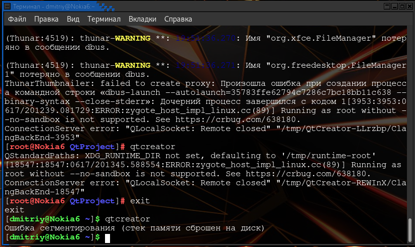

МИНИСТЕРСТВО НАУКИ  И ВЫСШЕГО ОБРАЗОВАНИЯ РОССИЙСКОЙ ФЕДЕРАЦИИ  
Федеральное государственное автономное образовательное учреждение высшего образования  
"КРЫМСКИЙ ФЕДЕРАЛЬНЫЙ УНИВЕРСИТЕТ им. В. И. ВЕРНАДСКОГО"  
ФИЗИКО-ТЕХНИЧЕСКИЙ ИНСТИТУТ  
Кафедра компьютерной инженерии и моделирования
  

### Отчёт по лабораторной работе № 7  по дисциплине "Программирование"
 

студента 1 курса группы ПИ-б-о-191(2) 
Кадников Дмитрий Андреевич
направления подготовки 09.03.04 "Программая инженерия"  
 

<table>
<tr><td>Научный руководитель  старший преподаватель кафедры  компьютерной инженерии и моделирования</td>
<td>(оценка)</td>
<td>Чабанов В.В.</td>
</tr>
</table>
  

Симферополь, 2019

***
######Цель:
0. изучить основные возможности создания и отладки программ в IDE Qt Creator.

***
#### Ход выполнения Работы
1. нажать на кнопку начало

нажать создать

выбрать "Консольное приложение Qt"

После нажимать кнопку далее

1. Инструменты->Параметры

Среда->Тема

1. Выделить нужную часть кода и нажать Ctrl+/.
2. Пкм по файлу Открыть каталог файла

1. .pro
2. Для сборки без отладки нажать на треугольник без жука, для сборки с отладкой нажать с жуком

1. Нажать на место перед номером строки

1. i = 32765

1. d = 0

1. i = 5

1. На linux нет MSVS
~~1. При попытке получить Calculator Form Example программа вылетает с ошибкой, после последнего обнавления системы qtcreator не работает от имени обычного пользователя (только от имени root), так же не получается получить другие проекты, надеюсь в обнавление с исправлениями придут скоро. (по мимо qtcreator перестал работать qterminal (ситуация такая же, переустановка не помогла(       )))~~

1. Просмотр документации по функции в другом проекте

1. qt дизайнер

1. Пришлось растинуть окно так как русский текст весь не влазил

#### Вывод
В ходе работы я научился ~~удалять настройки qt5~~ настраивать qtcreator и импортировать проекты.

