МИНИСТЕРСТВО НАУКИ  И ВЫСШЕГО ОБРАЗОВАНИЯ РОССИЙСКОЙ ФЕДЕРАЦИИ  
Федеральное государственное автономное образовательное учреждение высшего образования  
"КРЫМСКИЙ ФЕДЕРАЛЬНЫЙ УНИВЕРСИТЕТ им. В. И. ВЕРНАДСКОГО"  
ФИЗИКО-ТЕХНИЧЕСКИЙ ИНСТИТУТ  
Кафедра компьютерной инженерии и моделирования
  

### Отчёт по лабораторной работе № 7  по дисциплине "Программирование"
 

студента 1 курса группы ПИ-б-о-191(2) 
Кадников Дмитрий Андреевич
направления подготовки 09.03.04 "Программая инженерия"  
 

<table>
<tr><td>Научный руководитель  старший преподаватель кафедры  компьютерной инженерии и моделирования</td>
<td>(оценка)</td>
<td>Чабанов В.В.</td>
</tr>
</table>
  

Симферополь, 2019

***
### Цель:
1. изучить основные возможности создания и отладки программ в IDE Qt Creator.

***
### Ход выполнения Работы
1. нажать на кнопку начало

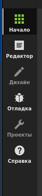

Рис 1 - кнопки в левом верхнем углу

нажать создать

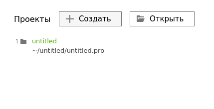

Рис 2 - создание проекта п1

выбрать "Консольное приложение Qt"

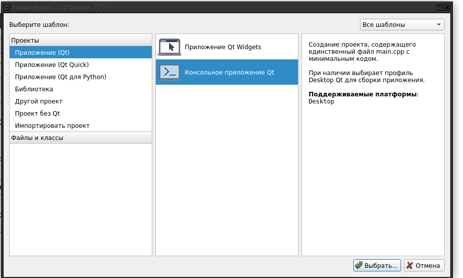

Рис 3 - создание проекта п2

После нажимать кнопку далее

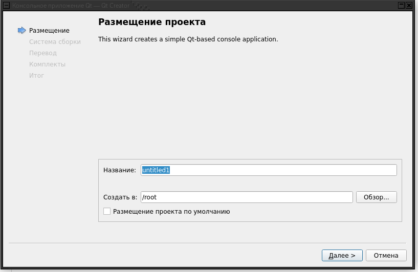

Рис 4 - создание проекта п3

2. Инструменты->Параметры

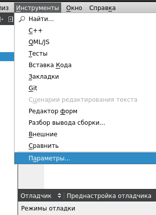

Рис 5 - Открытие параметров

Среда->Тема

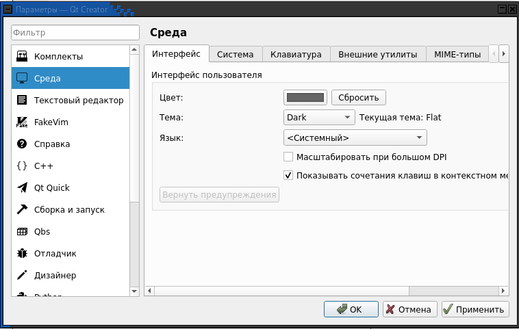

Рис 6 - Изменение темы

3. Выделить нужную часть кода и нажать Ctrl+/.

4. Пкм по файлу Открыть каталог файла

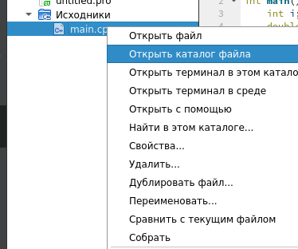

Рис 7 - открытие каталога

5. .pro

6. Для сборки без отладки нажать на треугольник без жука,
7. для сборки с отладкой нажать с жуком

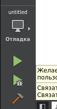

Рис 8 - кнопки в левом нижнем углу

8. Нажать на место перед номером строки

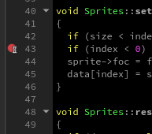

Рис 9 - Установка breakpoint

9.1.  i = 32765

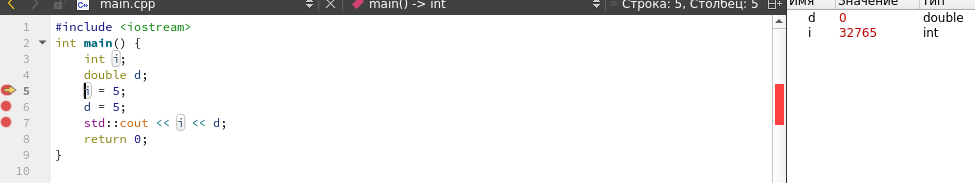

Рис 10 - Отладка, строка 5

9.2. d = 0

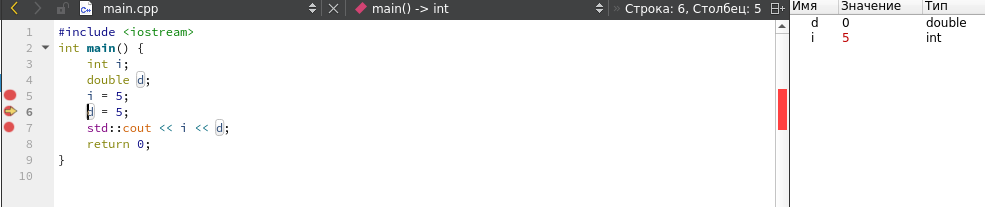

Рис 11 - Отладка, строка 6

9.3. i = 5

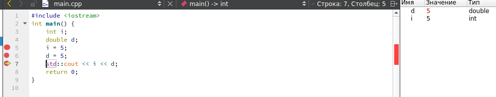

Рис 12 - Отладка, строка 7

9.4. На linux нет MSVS

15. Просмотр документации по функции в другом проекте

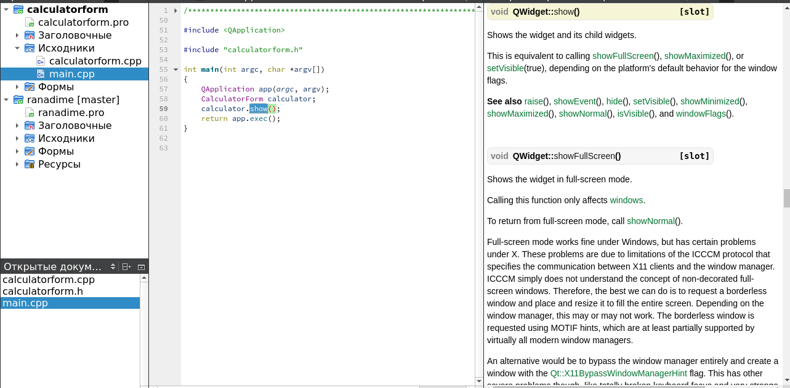

Рис 13 - Документация в qtcreator

16. qt дизайнер

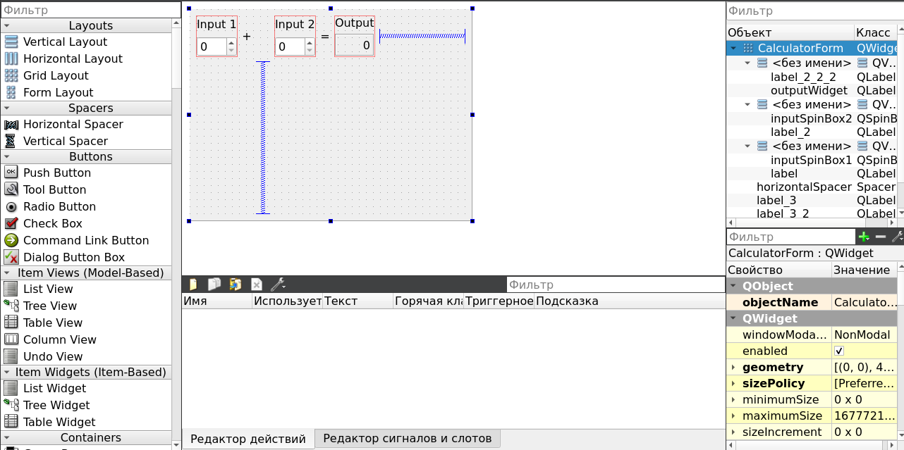

Рис 14 - qt Дизайнер

17. Пришлось растинуть окно так как русский текст весь не влазил

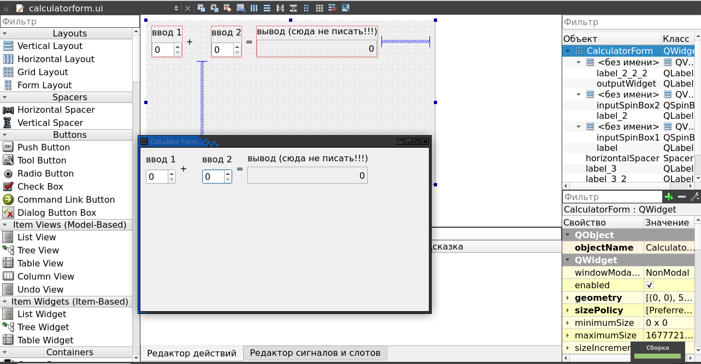

Рис 15 - Русский текст

### Вывод
В ходе работы я научился ~~удалять настройки qt5~~ настраивать qtcreator и импортировать проекты.

