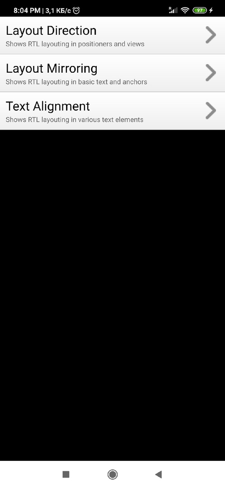

МИНИСТЕРСТВО НАУКИ  И ВЫСШЕГО ОБРАЗОВАНИЯ РОССИЙСКОЙ ФЕДЕРАЦИИ  
Федеральное государственное автономное образовательное учреждение высшего образования  
"КРЫМСКИЙ ФЕДЕРАЛЬНЫЙ УНИВЕРСИТЕТ им. В. И. ВЕРНАДСКОГО"  
ФИЗИКО-ТЕХНИЧЕСКИЙ ИНСТИТУТ  
Кафедра компьютерной инженерии и моделирования
  

### Отчёт по лабораторной работе № 8  по дисциплине "Программирование"
 

студента 1 курса группы ПИ-б-о-191(2) 
Кадников Дмитрий Андреевич
направления подготовки 09.03.04 "Программая инженерия"  
 

<table>
<tr><td>Научный руководитель  старший преподаватель кафедры  компьютерной инженерии и моделирования</td>
<td>(оценка)</td>
<td>Чабанов В.В.</td>
</tr>
</table>
  

Симферополь, 2019
***
Цель:

1. Настроить IDE Qt Creator для разработки приложений под android ОС;
2. Изучить базовые понятия связанные с мобильной разработкой;
3. Научиться создавать мобильные приложения при помощи фреймворка Qt 5.14.

***
Ход выполнения Работы

1. Скрин настроек

Рис 1 - скрин настроек

2. Произвольный проект, из списка примеров, для сборки под android. Проект называется  Right to left

Рис 2 - Произвольный проект, из списка примеров, для сборки под android.

3. Скрины запущеного с телефона ~~который друг доверил мне не смотря на то что я уже один раз превратил телефон в кирпич~~ проекта.

Рис 3 - Запущеное на телефоне приложение скрин

Рис 4 - Запущеное на телефоне приложение скрин 2

***
#### Вывод
В ходе работы я научился ~~плагиату~~ собирать программы написаные в qtcreator под андроид.
