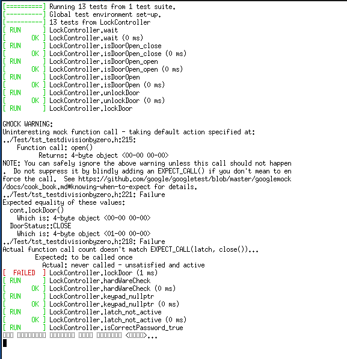

МИНИСТЕРСТВО НАУКИ  И ВЫСШЕГО ОБРАЗОВАНИЯ РОССИЙСКОЙ ФЕДЕРАЦИИ  
Федеральное государственное автономное образовательное учреждение высшего образования  
"КРЫМСКИЙ ФЕДЕРАЛЬНЫЙ УНИВЕРСИТЕТ им. В. И. ВЕРНАДСКОГО"  
ФИЗИКО-ТЕХНИЧЕСКИЙ ИНСТИТУТ  
Кафедра компьютерной инженерии и моделирования
<br/><br/>

### Отчёт по лабораторной работе № 9<br/> по дисциплине "Программирование"
<br/>

студента 1 курса группы ПИ-б-о-191(2) 
Кадников Дмитрий Андреевич
направления подготовки 09.03.04 "Программая инженерия"  
<br/>

<table>
<tr><td>Научный руководитель<br/> старший преподаватель кафедры<br/> компьютерной инженерии и моделирования</td>
<td>(оценка)</td>
<td>Чабанов В.В.</td>
</tr>
</table>
<br/><br/>

Симферополь, 2019
***
######Цель:
0. Научиться работать с текстовыми файлами;
0. Закрепить навыки работы со структурами.

######Задачи:


***
#### Ход выполнения Работы

Ссылка на репозиторий


Результаты тестов, как видно вызывался метод open, так же не вызывался метод close.


```C++
DoorStatus LockController::lockDoor();

DoorStatus LockController::lockDoor()
{
    return latch->close();
}
```
Ошибка скорей всего возникла в результате копирования реализации метода unlockDoor.


***
#### Вывод
В ходе работы я протестировал ~~mark2~~ проект и научился писать тесты при помощи google test. Осталось научиться писать тесты для тестирования тестов.
